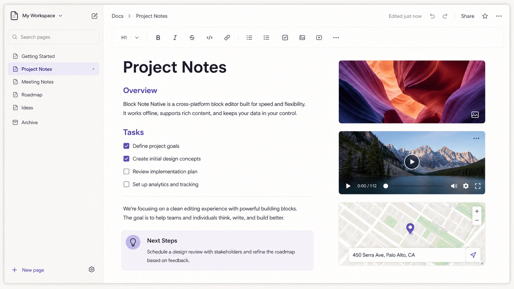

# BlockNote Native

[](https://github.com/sebastienaglae/block-note-native/actions/workflows/ci.yml)
[](./LICENSE)

A Notion-like, block-based rich-text editor (in the spirit of [BlockNote](https://github.com/TypeCellOS/BlockNote)) that runs on **web** and **React Native** with the **same features**, built from a single shared core. Supports **custom blocks and custom inline content**. No live collaboration (by design).

> BlockNote itself is built on ProseMirror/TipTap, which is DOM-only and cannot run on React Native. This project is a **from-scratch** implementation: a platform-agnostic core plus a thin, per-platform editable surface, so the *same* document model, commands, slash menu, toolbar, drag-to-reorder, and custom components work everywhere.



---

## ✨ Features

- **Block types:** paragraph, headings (1–3), bulleted / numbered / to-do lists, quote, code block, divider, image, **toggle list**, **toggle headings (1–3)**, **video**, **audio**, **file**, **web bookmark**, **map**, **table**, **link-to-page**.
- **Inline formatting:** bold, italic, underline, strikethrough, inline code, links, text color & highlight, **emoji**, **@mentions**.
- **Page header** — Notion-style **cover image**, **emoji icon** (with a picker), and a **fixed title** that can't be moved or deleted.
- **Page tree sidebar** — collapsible, page icons, favorites, and a per-item **⋯ menu** (favorite / rename / move / delete) + **+** to add a child. Pages contain pages.
- **Delete void blocks** — media & other void blocks (image, video, audio, file, bookmark, map, table, divider, custom void) show a hover delete button, since they have no text to empty; text blocks delete by clearing them, and **Delete** on an empty line removes the line.
- **Slash menu** (`/`) — filterable, grouped, keyboard-navigable, extensible.
- **@-mentions** — feed in a list of people; typing `@` opens a typeahead that inserts a highlighted mention.
- **Formatting toolbar** that floats over the selection (web) / docks above the keyboard (native).
- **Side menu** per block with an add button and a **drag handle** to reorder.
- **Keyboard model:** Enter splits, Backspace-at-start merges, **Tab / Shift-Tab** nest/un-nest, arrow navigation across blocks.
- **Markdown input rules:** `# `, `## `, `- `, `1. `, `[] `, `> `, ` ``` `, `---`.
- **Theming:** light / dark, **custom accent color** (any color → accent / soft / selection tints), and a **font switcher** (default / serif / mono).
- **Lock / read-only** mode — a hook for "live" features (presence, locking) without a backend.
- **Undo / redo** (covers content & page meta), JSON & Markdown **import/export** (with per-spec `toMarkdown` hooks so custom/media blocks export meaningfully), localStorage persistence.
- **Custom components** — define a block or inline content **once** (with React Native primitives) and it renders on both platforms.
- **Configurable media** — restrict video providers, choose the map destination (OpenStreetMap, Google Maps, or Apple Maps), and plug in asynchronous image-search providers.

---

## 🏗 Architecture

Three layers. The trick that makes "same features on both platforms" real is **[react-native-web](https://necolas.github.io/react-native-web/)**: all UI chrome and custom components are written once with RN primitives (`View`, `Text`, `Pressable`) and run on web via RNW. Only the low-level editable surface is platform-split.

```
block-note-native/                 # npm-workspaces monorepo
├─ packages/
│  ├─ core/         @sebastienaglae/bnn-core        Pure-TS engine: model, schema, Editor, transforms, history, markdown. No UI.
│  ├─ react/        @sebastienaglae/bnn-react       Cross-platform UI (RN primitives + RNW) + custom-component API.
│  └─ demo-shared/  @sebastienaglae/bnn-demo-shared ONE definition of demo custom components, used by both apps.
└─ apps/
   ├─ web/          Vite + React + react-native-web
   └─ native/       Expo (SDK 54)
```

**The editable surface is the only platform-split file:**

| File | Used on | Implementation |
|---|---|---|
| `packages/react/src/editable/RichTextInput.tsx` | Web (Vite) **and** Expo web | controlled `contentEditable` ⇄ model |
| `packages/react/src/editable/RichTextInput.native.tsx` | iOS / Android | controlled `TextInput` + segment diffing |

Both implement the same `RichTextInputProps` contract, so everything above them (blocks, menus, drag, custom components) is shared.

---

## 🚀 Getting started

Requires Node 18+.

```bash
npm install        # installs all workspaces
npm test           # runs the unit tests (@sebastienaglae/bnn-core + bnn-react)
```

### Run the web demo (Vite)

```bash
npm run dev:web    # → http://localhost:5173
```

### Run the native demo (Expo)

```bash
npm run start -w @bnn/native-demo        # Expo dev server (press i / a / w)
# or directly:
npm run web     -w @bnn/native-demo      # Expo on web (react-native-web)
npm run ios     -w @bnn/native-demo      # iOS simulator (macOS)
npm run android -w @bnn/native-demo      # Android emulator / device
```

> **Note:** iOS/Android require a simulator/emulator or the Expo Go app on a device. Expo-web and the Vite app both render the full editor via react-native-web and are the quickest way to try it.

### Type-check everything

```bash
npm run typecheck
```

---

## 🧩 Custom components

This is the headline feature. Define a component **once** with `@sebastienaglae/bnn-react`'s cross-platform primitives; it works on web and native.

### A custom block

```tsx
import { createReactBlockSpec, View, Text } from "@sebastienaglae/bnn-react";

export const CalloutBlock = createReactBlockSpec(
  {
    type: "callout",
    content: "inline",                              // "inline" = has editable text; "none" = void block
    propSchema: { emoji: { default: "💡" }, color: { default: "blue" } },
  },
  {
    // `render` receives the block, the editor, the theme, and `InlineContentView`
    // (place it wherever the editable text should go — the BlockNote `contentRef` equivalent).
    render: ({ block, theme, InlineContentView }) => (
      <View style={{ flexDirection: "row", backgroundColor: theme.highlightColors[String(block.props.color)], borderRadius: 6, padding: 12 }}>
        <Text style={{ fontSize: 18, marginRight: 10 }}>{String(block.props.emoji)}</Text>
        <View style={{ flex: 1 }}>{InlineContentView({ placeholder: "Write a note…" })}</View>
      </View>
    ),
    // Optional: auto-generate a slash-menu command for this block.
    slashMenu: { title: "Callout", icon: "💡", group: "Custom", aliases: ["note", "info"] },
  },
);
```

### A custom inline content (e.g. a mention)

```tsx
import { createReactInlineContentSpec, View, Text } from "@sebastienaglae/bnn-react";

export const MentionInline = createReactInlineContentSpec(
  { type: "mention", content: "none", propSchema: { user: { default: "" } } },
  {
    render: ({ inlineContent, theme }) => (
      <View style={{ backgroundColor: theme.colors.accentSoft, borderRadius: 4, paddingHorizontal: 4 }}>
        <Text style={{ color: theme.colors.accent, fontWeight: "500" }}>@{String(inlineContent.props.user)}</Text>
      </View>
    ),
  },
);
```

Insert it anywhere with `editor.insertInlineContent([{ type: "mention", props: { user: "Alice" }, content: [{ type: "text", text: "@Alice", styles: {} }] }])`.

### Assemble the schema and mount the editor

```tsx
import { BlockNoteView, useCreateEditor, createBlockNoteSchema } from "@sebastienaglae/bnn-react";

const schema = createBlockNoteSchema({
  blockSpecs: [CalloutBlock],
  inlineSpecs: [MentionInline],
  // extraSlashItems: [...]
});

function Editor() {
  const editor = useCreateEditor({
    initialContent: [{ type: "paragraph", content: "Hello!" }],
    blockSpecs: schema.blockSpecs,
    inlineSpecs: schema.inlineSpecs,
  });
  return (
    <BlockNoteView
      editor={editor}
      blockRenderers={schema.blockRenderers}
      inlineRenderers={schema.inlineRenderers}
      slashItems={schema.slashItems}
    />
  );
}
```

See [`packages/demo-shared/src/index.tsx`](packages/demo-shared/src/index.tsx) for the complete, real example — the **same file** is imported by both the [web](apps/web/src/App.tsx) and [native](apps/native/App.tsx) demos.

### Media options

Media behavior is configured once on `BlockNoteView` and uses the same API on web, iOS, and Android:

```tsx
<BlockNoteView
  editor={editor}
  media={{
    videoProviders: ["youtube", "direct"],
    mapProvider: "apple", // "google" or "openstreetmap"
    imageProviders: [{
      id: "unsplash",
      label: "Unsplash",
      search: async (query) => searchUnsplash(query),
    }],
  }}
/> 
```

An image provider returns `{ url, thumbnailUrl?, title? }` results. The picker is built from React Native primitives, so provider search and selection work on native without a web-only dependency. The media options are also available to custom block renderers through `BlockRenderProps.media`.

---

## 🧱 Composable, decoupled components

The page tree and the editor are **independent components** you can place anywhere:

```tsx
import { PageTree, BlockNoteView } from "@sebastienaglae/bnn-react";

<>
  <PageTree pages={pages} activeId={id} onSelect={...} onAddChild={...} onRename={...}
            onRemove={...} onToggleFavorite={...} onMove={...} theme={theme} />
  <BlockNoteView
    editor={editor}
    people={[{ id: "alice", name: "Alice" }]}   // enables @-mentions
    onOpenPage={(id) => switchTo(id)}
  />
</>
```

## 🌍 i18n (100% translatable)

See **[TRANSLATING.md](TRANSLATING.md)** for the full guide. In short:

Every user-facing string goes through `t(key, fallback)`. Pass your own translate function (any library):

```tsx
import i18next from "i18next";
import { BlockNoteView, PageTree, enLabels } from "@sebastienaglae/bnn-react";

// 1. Register the English catalog (then translate the values for other locales).
i18next.init({ lng: "fr", resources: { en: { translation: enLabels }, fr: { translation: { /* … */ } } } });

// 2. Adapt i18next to the (key, fallback) signature.
const t = (key: string, fallback: string) => i18next.t(key, { defaultValue: fallback });

<BlockNoteView editor={editor} t={t} />;   // PageTree also accepts `t`
```

`enLabels` is the full key catalog (slash menu, tree, block menu, toolbar, placeholders…). Nothing is hard-coded.

## 🎨 Icons & theming

Icons come from **lucide** (platform-split: `lucide-react` on web, `lucide-react-native` on native). Override any of them:

```tsx
import { BlockNoteView } from "@sebastienaglae/bnn-react";
import { Sparkles } from "lucide-react";

<BlockNoteView editor={editor} icons={{ add: Sparkles }} />;
```

The **accent color** is fully configurable (`accentColor="#7c3aed"`); it drives the accent, soft, and **text-selection** tints. No accent palette is baked in — you ship your own.

## 📦 Publishing (GitHub Packages)

The two libraries are published to **GitHub Packages** under the `@sebastienaglae` scope:

```bash
npm run build -w @sebastienaglae/bnn-core    # tsup  → dist (ESM + .d.ts)
npm run build -w @sebastienaglae/bnn-react   # tsc   → dist (preserves .native/.web files)
```

`@sebastienaglae/bnn-core` builds with **tsup**; `@sebastienaglae/bnn-react` builds with **tsc** so the platform-split files (`*.native.js`) survive for native consumers. Pushing a `v*` tag runs [`.github/workflows/publish.yml`](.github/workflows/publish.yml); PRs run [`.github/workflows/ci.yml`](.github/workflows/ci.yml) (test + type-check + build). Consumers add an `.npmrc` with `@sebastienaglae:registry=https://npm.pkg.github.com`.

> Native embeds (video / map / bookmark) use `react-native-webview`; maps use **OpenStreetMap** (Nominatim geocoding). These are optional peer deps — install them in your native app.

---

## 📚 Core API (`@sebastienaglae/bnn-core`)

The `Editor` is framework-agnostic and fully testable on its own:

```ts
import { Editor, blocksToMarkdown } from "@sebastienaglae/bnn-core";

const editor = new Editor({ initialContent: [{ type: "heading", content: "Hi" }] });

editor.insertBlocks([{ type: "paragraph", content: "world" }], editor.document[0].id, "after");
editor.updateBlock(id, { type: "bulletListItem" });
editor.toggleStyles({ bold: true });        // operates on the current selection
editor.nestBlock(id); editor.unnestBlock(id);
editor.moveBlock(id, targetId, "after");
editor.undo(); editor.redo();

console.log(blocksToMarkdown(editor.document));
```

`subscribe(listener)` + `getSnapshot()` make it a drop-in source for React's `useSyncExternalStore` (see `useEditorState`).

---

## ⚠️ Known limitations (MVP scope)

- **No live collaboration** — intentionally excluded.
- **Selection** is within a single block (covers caret + range formatting). Cross-block selection isn't implemented.
- **Drag-to-reorder** targets top-level blocks; use **Tab / Shift-Tab** to change nesting.
- On **native (iOS/Android)**, text typed inside a styled run inherits that run's style (Notion-like). The richest inline-editing fidelity is on web; the native `TextInput` surface is implemented but is best validated on a real device/emulator.
- The web `contentEditable` does a best-effort job importing pasted HTML styling.

---

## 🧪 What's verified

- **39 unit tests** (`npm test`): `@sebastienaglae/bnn-core` covers split/merge/indent/outdent, forward-delete, inline mark toggling, markdown round-trip, block ops, page metadata, and history; `@sebastienaglae/bnn-react` guards the i18n catalog.
- Web (Vite): rendering, editing, slash menu (+ custom items), formatting toolbar, markdown rules, Tab nesting, persistence — all exercised.
- Native (Expo): bundles cleanly through Metro in the monorepo and renders the full editor (incl. custom block + mention) via react-native-web; the same shared code path.

---

## 📥 Use it in your own app

The two libraries are published to **GitHub Packages**. Add an `.npmrc` next to your `package.json`:

```
@sebastienaglae:registry=https://npm.pkg.github.com
```

```bash
# Core engine (framework-agnostic)
npm install @sebastienaglae/bnn-core

# Editor UI (+ peers for your platform)
npm install @sebastienaglae/bnn-react react
#   web:    react-dom react-native-web lucide-react
#   native: react-native lucide-react-native react-native-svg react-native-webview
```

See the package READMEs — [`@sebastienaglae/bnn-core`](packages/core/README.md) and [`@sebastienaglae/bnn-react`](packages/react/README.md) — for quick-starts. Installing from GitHub Packages requires authenticating `npm` to GitHub (a token with `read:packages`).

**Feeding the editor from your website** (passing content in, reading it back, JSON/Markdown round-trip): see **[EMBEDDING.md](EMBEDDING.md)**. **Localizing the UI:** see **[TRANSLATING.md](TRANSLATING.md)**.

---

## 🤝 Contributing

See [CONTRIBUTING.md](CONTRIBUTING.md) for setup, the workspace layout, day-to-day commands, and the tag-driven release process.

## 📄 License

[MIT](LICENSE) © Sébastien Aglaé
